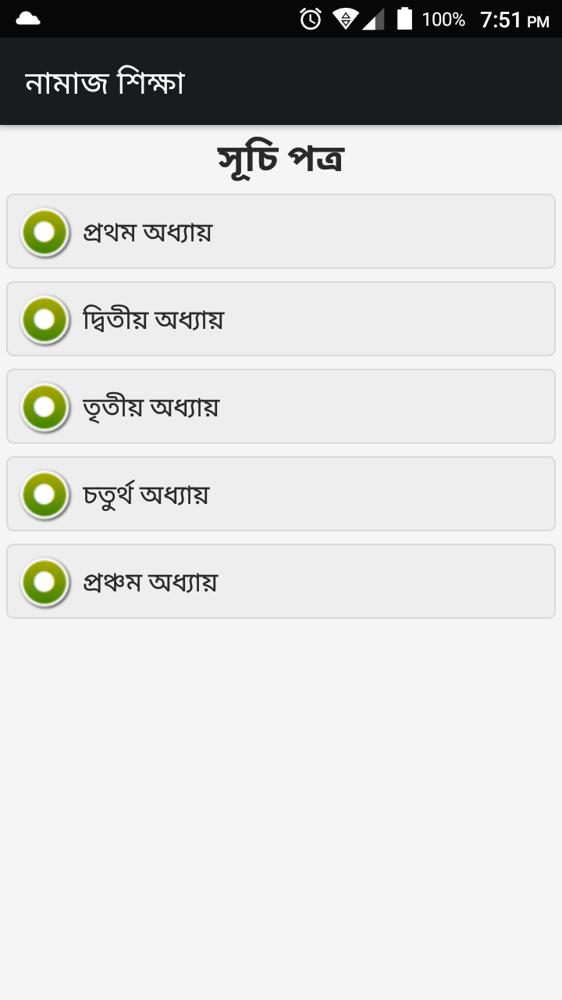
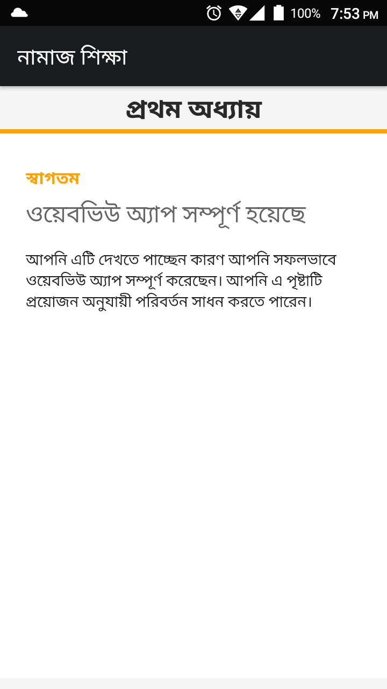

# WebToApp

Simple WebView App for Android Studio.

## Screenshots
| Splash Screen | Pages List | Details |
| :-------------: | :-------------: |:-------------: |
|  |  |  |

## Build
To open this project in Android Studio, begin by checking out of the branches, and then open the `WebToApp/` dictionary in Android Studio. 

The following series of steps illustrate how to open the `WebToApp` branch.

Clone the repository:
```
git clone https://github.com/sobujbd/WebToApp.git
```

Checkout the master branch:
```
git checkout master
```

Finally open the `WebToApp/` directory in Android Studio.